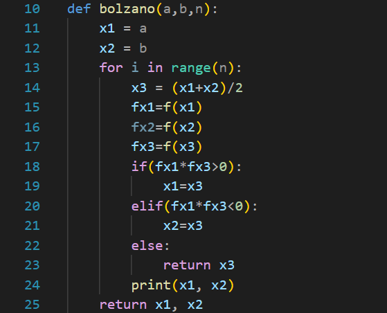

# Praktikum 1 Komputasi Numerik D Kelompok 14
## Anggota
* Muhamad Faiz Fernanda - 5025211186
* Farhan Dwi Putra - 5025211093
* Thoriq Afif Habibi - 5025211154
## Penjelasan hasil praktikum
Pertama, saya membuat fungsi bolzano yang akan menerapkan metode bolzano untuk mencari akar persamaan. Fungsi ini memiliki 3 parameter, yaitu a sebagai xn, b sebagai xn+1, dan n sebagai banyak iterasi yang ingin dilakukan. Saya membuat variabel xn dan xn+1 yang diisi nilai a dan b. Pada fungsi ini, diasumsikan terjadi perubahan tanda pada interval xn hingga xn+1. Saya kemudian menggunakan perulangan hingga n dan menghitung xt yang bernilai (xn+x(n+1))/2, f(xn), f(xn+1), serta f(xt). Penentuan apakah xt menggantikan xn atau xn+1 ditentukan dengan conditional statement yang dapat dilihat pada code di bawah:

Pada solusi yang kami buat, fungsi, xn, xn+1, dan jumlah iterasi diletakkan pada source code dan tidak pada input user. Oleh karena itu, mendefinisikan mereka pada source code sebagi berikut:
.png)
.png)
